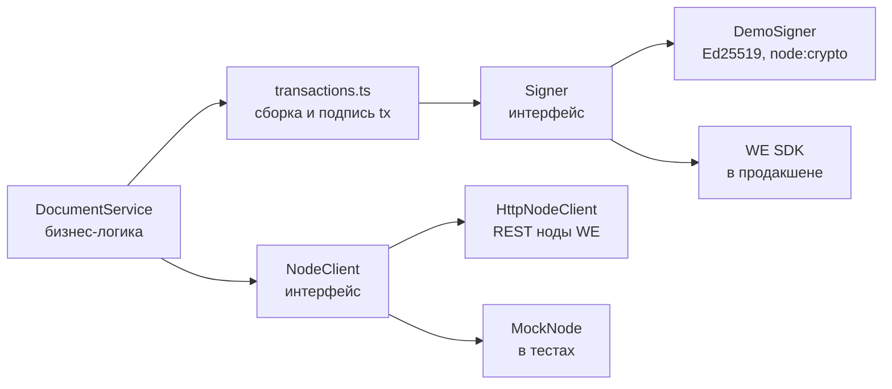

# Waves Enterprise Integration

Модуль бизнес-логики на TypeScript: токенизация и учёт документов в блокчейне
[Waves Enterprise](https://wavesenterprise.com). Документ регистрируется в
state Docker-контракта по SHA-256-хешу — это даёт неизменяемое доказательство
существования, проверку целостности и передачу владения.

## Возможности

- **Регистрация документа** — хеш содержимого + метаданные записываются в контракт (CallContract, tx type 104)
- **Проверка целостности** — по содержимому находим запись в state контракта; любое изменение файла меняет хеш
- **Передача владения** — только текущий владелец может передать документ другому публичному ключу
- **Деплой реестра** — CreateContract (tx type 103)
- **Transfer** (tx type 4) — перевод токенов между аккаунтами

## Архитектура



| Слой | Файл | Что делает |
|---|---|---|
| Бизнес-сервис | `src/documentService.ts` | регистрация, проверка, передача владения |
| Транзакции | `src/transactions.ts` | Transfer (4), CreateContract (103), CallContract (104), подпись, id |
| Клиент ноды | `src/nodeClient.ts` | интерфейс `NodeClient` + REST-реализация (`fetch`) |
| Подпись | `src/signer.ts` | интерфейс `Signer` + демо-реализация на Ed25519 |

Все сетевые вызовы идут через интерфейс `NodeClient`, поэтому бизнес-логика
тестируется без сети — в тестах подставляется in-memory мок.

## Стек

- TypeScript 5 (strict), Node.js >= 18 (используется глобальный `fetch`)
- `node:crypto` — SHA-256 и Ed25519, без внешних runtime-зависимостей
- Jest + ts-jest — unit-тесты

## Запуск тестов

```bash
npm install
npm test
```

Тесты не требуют сети и запущенной ноды.

## Подключение к реальной ноде WE

```ts
import { DemoSigner, DocumentService, HttpNodeClient } from "./src";

const node = new HttpNodeClient("https://node.your-network.com/node-0", "API_KEY");
const signer = new DemoSigner(); // в бою — реализация Signer поверх SDK

// один раз: деплой контракта-реестра
const contractId = await DocumentService.deployRegistry(node, signer);

const docs = new DocumentService(node, signer, contractId);
const { record, txId } = await docs.registerDocument(fileBuffer, "contract.pdf");
const check = await docs.verifyDocument(fileBuffer); // { registered: true, record }
await docs.transferOwnership(record.hash, recipientPublicKey);
```

### Важно про подпись

Подпись вынесена за интерфейс `Signer`. `DemoSigner` (Ed25519 из `node:crypto`)
подходит для разработки и тестов, но реальная нода Waves Enterprise проверяет
подписи Curve25519 над **бинарной** сериализацией транзакции. Для продакшена
реализуйте `Signer` поверх официального SDK
(`@wavesenterprise/signature-generator` / we-sdk) — бизнес-слой при этом не
меняется. Аналогично `txBytes()` в `src/transactions.ts` использует
канонический JSON и в бою заменяется сериализатором SDK.

## Структура

```
src/
  index.ts            # публичный API модуля
  documentService.ts  # бизнес-логика реестра документов
  transactions.ts     # типы и сборка транзакций 4 / 103 / 104
  nodeClient.ts       # NodeClient (интерфейс) + HttpNodeClient (REST)
  signer.ts           # Signer (интерфейс) + DemoSigner
  base58.ts           # base58 encode/decode
test/
  documentService.test.ts
```

---

**Студия Лендвис** — разработка сложных IT-продуктов.

[lendvis.ru](https://lendvis.ru) · [hello@lendvis.ru](mailto:hello@lendvis.ru) · [Telegram](https://t.me/lendvis)
